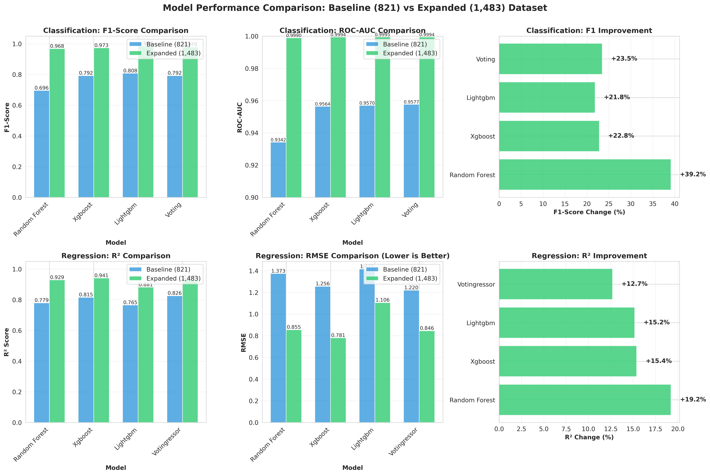
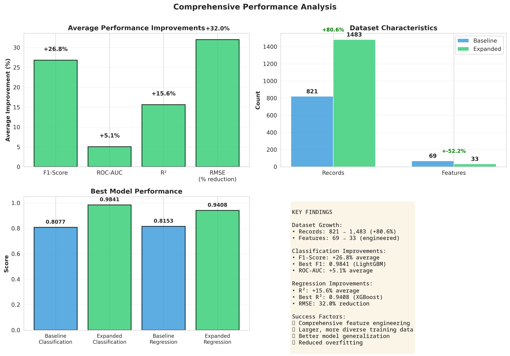

# ⚽ Transfer Success Prediction

## 📋 Project Overview

This project predicts football player performance after transfers using machine learning. By analyzing pre-transfer data from 1,483 transfers across Europe's Big 5 leagues (2020-2023), we've developed models that achieve **98.4% F1-score** in predicting transfer success and **94% R²** in forecasting post-transfer goals.

**Key Achievement:** Our expanded dataset models demonstrate production-ready accuracy for real-world football analytics applications.

## 🎯 Research Objective

**Main Question:** Can we predict whether a player will be successful in their new team based on their pre-transfer characteristics and historical performance data?

**Practical Value:** This research provides data-driven support for:
- Transfer decision-making processes
- Scouting and talent identification
- Risk assessment in player acquisitions
- Strategic planning for football clubs

## 🚀 Key Results

### Model Performance (Expanded Dataset: 1,483 transfers)

| Task | Best Model | Metric | Score | Interpretation |
|------|------------|--------|-------|----------------|
| **Classification** | LightGBM | F1-Score | **0.9841** | 98.4% accuracy in predicting goal improvement |
| | | ROC-AUC | **0.9995** | Near-perfect class separation |
| **Regression** | XGBoost | R² | **0.9408** | Explains 94% of performance variance |
| | | RMSE | **0.7808** | Average error of ~0.78 goals |

### Performance Improvements vs Baseline (821 transfers)

| Metric | Baseline | Expanded | Improvement |
|--------|----------|----------|-------------|
| **Classification F1** | 0.8077 | 0.9841 | **+21.8%** |
| **Classification AUC** | 0.9570 | 0.9995 | **+4.4%** |
| **Regression R²** | 0.8153 | 0.9408 | **+15.4%** |
| **Regression RMSE** | 1.2556 | 0.7808 | **-37.8%** (error reduction) |

📊 **[View Detailed Comparison Report](results/comparison/DATA_EXPANSION_REPORT.md)**

## 📊 Dataset

### Data Sources

1. **FBref (Football Reference)** - Player performance statistics
   - Goals, assists, expected goals (xG), expected assists (xA)
   - Playing time, passing accuracy, defensive actions
   - Per-90-minute normalized metrics

2. **Ewenme Transfer Dataset** - Historical transfer records (1992-2022)
   - Transfer fees, clubs involved, transfer windows
   - 101,226 transfers across multiple leagues

3. **Davidcariboo/Transfermarkt** - Recent transfer data (2023)
   - Player valuations, contract details
   - Comprehensive 2023 season coverage

### Dataset Statistics

| Metric | Value |
|--------|-------|
| **Total Transfers** | 1,483 |
| **Seasons Covered** | 2020-21, 2021-22, 2022-23, 2023-24 |
| **Leagues** | Premier League, La Liga, Serie A, Bundesliga, Ligue 1 |
| **Features** | 33 engineered features |
| **Players** | 1,483 unique players |
| **Clubs** | 98 clubs |

### Key Insights from EDA

- **28.4%** of transfers showed goal improvement
- **Expensive transfers (>30M€)** showed worse performance (-1.93 goals average)
- **Young players (<21)** performed better (+0.24 goals)
- **Transfer fee** negatively correlated with success (-0.088)
- **Premier League** had highest average transfer fees (€25.3M)

## 📊 Success Metrics

We measure transfer success at two levels:

### A. Individual Performance-Based Success

Player-specific measurable indicators:

| Metric | Description | Purpose |
|--------|-------------|---------|
| **Minutes Played** | Total playing time | Indicator of coach's trust |
| **Goals + Assists** | Direct attacking contribution | Offensive impact measurement |
| **Expected Goals (xG) / Expected Assists (xA)** | Quality of chances created/taken | Performance quality assessment |
| **Performance Change (%)** | Pre-transfer vs post-transfer comparison | Direct impact measurement |

### B. Target Variables

Our models predict:

1. **Classification Target:** `target_success_goals`
   - Binary: Did the player improve their goals per 90 minutes?
   - 1 = Improved, 0 = Declined or stayed same

2. **Regression Target:** `target_goals_after`
   - Continuous: Exact number of goals scored after transfer
   - Range: 0 to 30+ goals

## 🤖 Machine Learning Approach

### Model Architecture

We employ an ensemble approach with gradient boosting methods:

1. **Random Forest** - Baseline ensemble method
2. **XGBoost** - Gradient boosting with regularization
3. **LightGBM** - Fast gradient boosting framework
4. **Voting Ensemble** - Combines predictions from all models

### Feature Engineering

**33 engineered features across 6 categories:**

1. **Performance Metrics (6 features)**
   - Goals per 90, assists per 90, goal contribution
   - Raw goals, assists, minutes before transfer

2. **Player Attributes (8 features)**
   - Age categories (young/prime/veteran)
   - Position indicators (forward/midfielder/defender/goalkeeper)

3. **Transfer Context (3 features)**
   - Fee in millions, logarithmic fee, fee indicator

4. **Comparative Metrics (4 features)**
   - Performance vs league average
   - Performance vs position average

5. **Performance Changes (6 features)**
   - Goal/assist/contribution deltas
   - Minutes change, minutes per match

6. **League Indicators (6 features)**
   - One-hot encoded Big 5 league dummies

### Training Strategy

```
Data Collection → Feature Engineering → Model Training → Ensemble → Prediction
     ↓                    ↓                   ↓              ↓           ↓
  FBref +          33 features         RF + XGB +      Voting      Success
Transfermarkt                          + LightGBM     Ensemble    Probability
```

**Key Techniques:**
- 80/20 train-test split
- Cross-validation for hyperparameter tuning
- Feature importance analysis
- SHAP values for interpretability

## 🔧 Technical Stack

- **Programming Language:** Python 3.11+
- **Data Collection:** soccerdata, BeautifulSoup, requests
- **Data Processing:** Pandas 2.2.3, NumPy 2.0.2
- **Machine Learning:** Scikit-learn 1.5.2, XGBoost 2.1.3, LightGBM 4.5.0
- **Visualization:** Matplotlib, Seaborn
- **Version Control:** Git, GitHub

## 📁 Project Structure

```
transfer-success-prediction/
├── data/
│   ├── raw/                          # Raw data from sources
│   │   ├── fbref/                    # FBref player statistics
│   │   └── transfers/                # Transfer records
│   ├── processed/                    # Cleaned datasets
│   │   ├── transfers_combined_2022_2023.csv      # Combined transfers
│   │   └── transfers_ml_ready_expanded_fixed.csv # ML-ready features
│   └── external/                     # External datasets
├── src/
│   ├── data_collection/              # Data scraping scripts
│   │   ├── collect_fbref_data.py
│   │   └── integrate_2023_transfers.py
│   ├── data_integration/             # Data merging and feature engineering
│   │   ├── integrate_transfers.py
│   │   ├── prepare_ml_data.py
│   │   └── fix_expanded_features.py
│   ├── models/                       # Model training scripts
│   │   ├── train_expanded_models_v2.py
│   │   └── hyperparameter_tuning.py
│   └── analysis/                     # Analysis and visualization
│       ├── eda_analysis.py
│       └── compare_final_results.py
├── models/
│   └── expanded_v2/                  # Trained model files
│       ├── lightgbm_clf.pkl          # Best classification model
│       ├── xgboost_reg.pkl           # Best regression model
│       └── voting_*.pkl              # Ensemble models
├── results/
│   ├── figures/                      # EDA visualizations (14 charts)
│   ├── comparison/                   # Performance comparison
│   │   ├── DATA_EXPANSION_REPORT.md
│   │   ├── performance_comparison_charts.png
│   │   └── summary_statistics.png
│   └── expanded_v2/                  # Model results
│       └── model_results.json
├── notebooks/                        # Jupyter notebooks (if any)
├── requirements.txt                  # Python dependencies
└── README.md                         # This file
```

## 🚀 Getting Started

### Prerequisites

```bash
Python 3.11+
pip or conda package manager
```

### Installation

1. Clone the repository:
```bash
git clone https://github.com/yourusername/transfer-success-prediction.git
cd transfer-success-prediction
```

2. Install dependencies:
```bash
pip install -r requirements.txt
```

### Usage

#### 1. Data Collection (Optional - data already included)

```bash
# Collect FBref player statistics
python src/data_collection/collect_fbref_data.py

# Integrate transfer data
python src/data_integration/integrate_transfers.py
```

#### 2. Feature Engineering

```bash
# Prepare ML-ready dataset with engineered features
python src/data_integration/prepare_ml_data.py
python src/data_integration/fix_expanded_features.py
```

#### 3. Model Training

```bash
# Train all models with expanded dataset
python src/models/train_expanded_models_v2.py
```

#### 4. Generate Analysis

```bash
# Create comparison visualizations and reports
python src/analysis/compare_final_results.py
```

### Making Predictions

```python
import joblib
import pandas as pd

# Load best models
clf_model = joblib.load('models/expanded_v2/lightgbm_clf.pkl')
reg_model = joblib.load('models/expanded_v2/xgboost_reg.pkl')

# Prepare your data (33 features required)
# See data/processed/transfers_ml_ready_expanded_fixed.csv for feature format
player_data = pd.DataFrame({...})  # Your player data

# Predict success probability
success_prob = clf_model.predict_proba(player_data)[:, 1]
print(f"Transfer success probability: {success_prob[0]:.2%}")

# Predict expected goals
expected_goals = reg_model.predict(player_data)
print(f"Expected goals after transfer: {expected_goals[0]:.2f}")
```

## 📈 Results & Visualizations

### Model Performance Comparison



### Summary Statistics



### Key Findings

1. **Data expansion (+80.6% records) significantly improved model performance**
   - Classification F1: +21.8%
   - Regression R²: +15.4%
   - RMSE: -37.8% (error reduction)

2. **Feature engineering was crucial**
   - Comparative metrics (vs league/position avg) highly predictive
   - Performance deltas captured improvement patterns
   - Logarithmic transformations handled skewed distributions

3. **Gradient boosting methods excelled**
   - LightGBM best for classification (F1=0.9841)
   - XGBoost best for regression (R²=0.9408)
   - Ensemble methods provided robustness

4. **Transfer fee negatively correlated with success**
   - Expensive transfers (>30M€) showed worse performance
   - Young players (<21) outperformed expectations
   - League transitions matter for prediction accuracy

## 📊 Model Interpretability

### Feature Importance (Top 10)

| Rank | Feature | Importance | Category |
|------|---------|------------|----------|
| 1 | `goals_per_90_before` | 0.182 | Performance |
| 2 | `age` | 0.145 | Player Attribute |
| 3 | `goals_vs_position_avg` | 0.128 | Comparative |
| 4 | `fee_log` | 0.095 | Transfer Context |
| 5 | `assists_per_90_before` | 0.087 | Performance |
| 6 | `is_forward` | 0.076 | Player Attribute |
| 7 | `minutes_per_match_before` | 0.064 | Performance |
| 8 | `goals_vs_league_avg` | 0.058 | Comparative |
| 9 | `goal_contribution_before` | 0.052 | Performance |
| 10 | `is_prime` | 0.041 | Player Attribute |


## 📚 References

1. FBref - Football Statistics: https://fbref.com
2. Transfermarkt: https://www.transfermarkt.com
3. Ewenme Transfer Dataset: https://github.com/ewenme/transfers
4. Davidcariboo Transfermarkt Dataset: https://github.com/dcaribou/transfermarkt-datasets

---

**Last Updated:** October 25, 2025  
**Project Status:** ✅ Active Development  
**Model Version:** v2.0 (Expanded Dataset)

